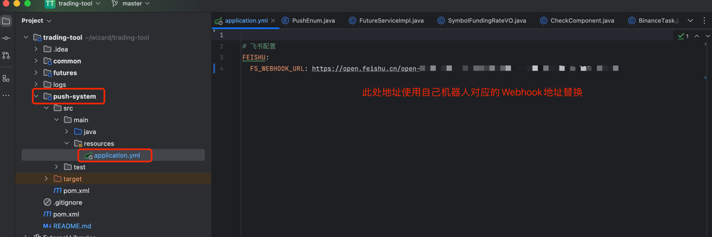
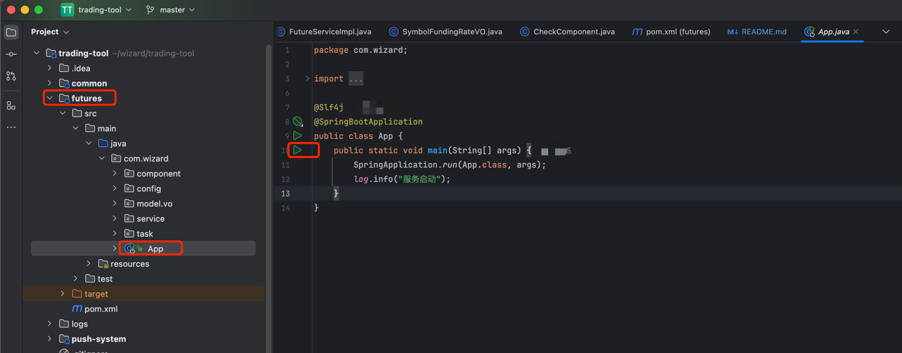

## 项目用途
一个用于辅助交易小工具

## 如何使用
### 创建飞书群里并添加机器人
首先创建飞书群聊，并添加群聊机器人。如果没有固定IP地址,可以在安全设置中，只添加自定义关键词，建议添加【标的】。另外Webhook地址需要配置到对应配置文件中，如图所示

### 拉取项目并运行
* 1、拉取项目
* 2、Java8环境
* 3、修改配置文件，主要为飞书机器人地址
* 4、运行项目

## 已完成功能

* 1、新增或下架交易对
* 2、合约持仓量异常增长
* 3、自动推送负费率标的
* 4、增加TA-LIB技术指标计算